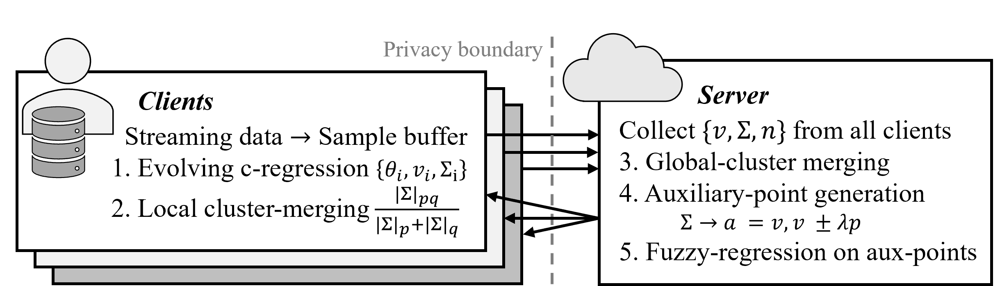

Evolving Gaussian Federated Regression (eGauss+FR)
------------------------------------- 
M. Ožbot, P. V. C. Souza, and I. Škrjanc, “Evolving Gaussian Systems as a Framework for Federated Regression Problems,” IEEE Transactions on Fuzzy Systems, vol. 33, no. 10, pp. 3736–3746, Oct. 2025, doi: 10.1109/TFUZZ.2025.3601900.

This repository contains the implementation of Evolving Federated Regression (eGauss+FR) — a framework that combines federated learning with evolving fuzzy c-regression / c-varieties clustering to learn nonlinear regression models without sharing raw data. Clients process data streams incrementally, discover local linear regions on-the-fly, and share only compact cluster statistics with a server, which merges them into a global fuzzy regressor.

## How it works
1) **Client**: Stream samples → pick winning cluster → RLS update of the local affine model (prototype); accept only if inside dual gate (prototype distance + center distance). Maintain buffers for unrepresented samples that can not yet form clusters, merge overlapping clusters.
2) **Server**: Receive triples `(v, Σ, n)` (no raw data, only clusters with `n ≥ κ_n`), merge globally, compute auxiliary points along principal directions, fit fuzzy local-linear regressor.
3) **Predict**: Weighted sum of local linear models via Gaussian memberships.

  

Requirements
-------------------------------------
- MATLAB R2022b (tested)
- Statistics and Machine Learning Toolbox (for chi2inv)

## `main.m` parameters
- `scenarios` (1–8) — dataset + meta-parameter presets (see switch/case in `main.m`)
- `clientCounts` — vector of client counts, e.g., `[1 3 10 30]`
- `nReps` — repetitions per setting
- `p` — probability for minimal cluster size
- `testFraction` — fraction for test split (e.g., `0.2`)
- `flag_debug` — `0` off, `1` on
- `flag_generate_data` — `1` to (re)generate and distribute data; only needed once, then `0`

-------------------------------------
## Federated-learning hyperparameters (struct `params`)
- `params.ipsilon` — RLS forgetting factor γ (e.g., `0.99`): higher = smoother/slower drift
- `params.lambda_d` — prototype-distance gate scale (e.g., `chi2inv(p_gate, 1)`): higher = fewer/larger clusters
- `params.lambda_r` — center-distance gate scale (e.g., `chi2inv(p_gate, m+1)`): higher = wider acceptance near centers
- `params.epsilon_tolR` — additive tolerance for center-distance gate (quantization/range buffer)
- `params.epsilon_tolD` — additive tolerance for prototype-distance gate (noise/mismatch buffer)
- `params.kappa_m` — merge threshold for ellipsoid-volume ratio (≈ `1.0–1.1`; higher = more aggressive merges)
- `params.kappa_n` — minimum samples to share a cluster (privacy/stability; ≥ `m+1` recommended)
- `params.c_merge` — when local `c ≥ c_merge`, run merge (e.g., `ceil(sqrt(N_j))`)

## Notes & tips
- If clusters explode in number: increase `lambda_d`, `lambda_r`, raise `kappa_m`, or merge more often
- If underfitting: decrease `lambda_d`, `lambda_r`, lower `kappa_m`, allow more clusters before merging